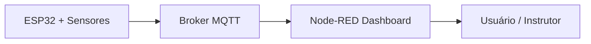

# 🎓 Educação e Requalificação Profissional  
### 🌐 Aprendizado Automatizado | ⚡ Feedback em Tempo Real | 🎮 Gamificação

---

## 👥 **Integrantes**
- **Murilo Macedo Pina** — RM: 563397  
- **Alexandre Martins Lucas** — RM: 561732  
- **Vitor Carvalho Alexandre** — RM: 562298  

---

## 📖 **Contexto do Desafio**

> “Imagine como será o futuro do trabalho em um cenário onde a tecnologia está em todos os lugares e as relações humanas se tornam cada vez mais centrais...”

O futuro do trabalho exige **aprendizado contínuo**, **requalificação** e **bem-estar**.  
Com o avanço da **Inteligência Artificial (IA)** e das transformações digitais, surge a necessidade de soluções **educacionais inovadoras**, que unam **tecnologia, interatividade e personalização**.

---

## 💡 **Descrição da Solução**

A proposta é um **sistema inteligente de educação e requalificação profissional**, com três pilares fundamentais:

### 🧠 1. Aprendizado Automatizado  
O sistema utiliza **IA e sensores conectados via ESP32** para monitorar o progresso do aluno, identificar dificuldades e adaptar o conteúdo de forma personalizada.

### ⚡ 2. Feedback em Tempo Real  
Com base nos dados enviados via **protocolo MQTT**, o sistema fornece **feedbacks instantâneos** sobre desempenho e engajamento.  
Essas informações são exibidas em um **dashboard interativo no Node-RED**.

### 🎮 3. Gamificação  
A plataforma implementa **elementos de jogo** — pontuação, níveis e conquistas — para **aumentar o engajamento** e **motivar o aprendizado**.  
Cada conquista gera **pontos e recompensas virtuais**, exibidas no painel do usuário.

---

## 🧩 **Arquitetura do Sistema**



| 🔧 **Componente** | **Função** |
|------------------|------------|
| ESP32 | Coleta e envia dados sobre aprendizado e progresso |
| Broker MQTT (HiveMQ) | Gerencia a comunicação em tempo real |
| Node-RED Dashboard | Exibe dados, gráficos e feedbacks |
| IA + Python | Analisa o desempenho e sugere melhorias |
| HTML/CSS/JS | Interface visual e simulação de interações |

---

## 🧠 **Explicação Técnica — MQTT e HTTP**

### 🔹 MQTT
- **Tópico publicado:** `/educacao/feedback`  
- **Tópico assinado:** `/educacao/comandos`  

**Exemplo de payload:**
```json
{
  "usuario": "Vitor",
  "progresso": 85,
  "nivel": "Intermediário",
  "pontuacao": 1200
}
```

### 🔹 Endpoints HTTP (Node-RED)
- `POST /api/feedback` → Envia feedbacks e atualizações  
- `GET /api/status` → Consulta status atual do aluno  

Esses endpoints permitem a integração entre **dashboard**, **IA** e **banco de dados**.

---

## 💻 **Códigos-Fonte — ESP32 (.ino)**

```cpp
#include <WiFi.h>
#include <PubSubClient.h>

const char* ssid = "Wokwi-GUEST";
const char* password = "";
const char* mqtt_server = "test.mosquitto.org";
const int mqtt_port = 1883;

WiFiClient espClient;
PubSubClient client(espClient);
unsigned long lastReconnectAttempt = 0;
const unsigned long RECONNECT_INTERVAL = 5000;

const char* TOPICO_STATUS = "gsEdge/analise/status";
const char* TOPICO_DADOS = "gsEdge/analise/dados";
const char* TOPICO_CONTROLE = "gsEdge/analise/controle";

struct AnaliseEducacional {
  float aprendizadoAutomatizado;
  float feedbackTempoReal;
  float gamificacao;
};

AnaliseEducacional analise;

void setup_wifi() {
  Serial.println();
  Serial.print("Conectando-se a ");
  Serial.println(ssid);
  WiFi.disconnect(true);
  delay(1000);
  WiFi.begin(ssid, password);
  while (WiFi.status() != WL_CONNECTED) {
    delay(500);
    Serial.print(".");
  }
  Serial.println("\n✅ WiFi conectado!");
}

void callback(char* topic, byte* payload, unsigned int length) {
  Serial.print("📨 Mensagem recebida no tópico: ");
  Serial.println(topic);
}

boolean reconnect() {
  String clientId = "ESP32-Educacional-";
  clientId += String(random(0xffff), HEX);
  if (client.connect(clientId.c_str())) {
    Serial.println("✅ Conectado ao broker!");
    client.subscribe(TOPICO_CONTROLE);
  }
  return client.connected();
}

void setup() {
  Serial.begin(115200);
  setup_wifi();
  client.setServer(mqtt_server, mqtt_port);
  client.setCallback(callback);
}

void loop() {
  if (!client.connected()) reconnect();
  client.loop();

  analise.aprendizadoAutomatizado = random(600, 1000) / 10.0;
  analise.feedbackTempoReal = random(500, 1000) / 10.0;
  analise.gamificacao = random(400, 1000) / 10.0;

  char msg[200];
  snprintf(msg, sizeof(msg),
           "{"aprendizado_automatizado": %.1f, "feedback_tempo_real": %.1f, "gamificacao": %.1f}",
           analise.aprendizadoAutomatizado,
           analise.feedbackTempoReal,
           analise.gamificacao);

  client.publish(TOPICO_DADOS, msg);
  delay(3000);
}
```

---

## 📊 **Dashboard**

O Dashboard (Node-RED ou GitHub Pages) exibe:

- 📈 Gráficos de desempenho  
- 🧩 Indicadores de gamificação  
- 🤖 Feedbacks automáticos via IA  

---

## 🧭 **Como Executar**

```bash
# 1️⃣ Abra o repositório no GitHub
# 2️⃣ Vá até a aba "Pages" e clique no link do deploy
# 3️⃣ Ou execute localmente:
node-red
# Acesse: http://localhost:1880
```

**Principais fluxos:**
- `mqtt in` → Recebe dados do ESP32  
- `chart` → Exibe o progresso  
- `text` → Mostra mensagens e feedbacks  

---

## 🧰 **Instruções de Uso e Replicação**

**Projeto Wokwi:**  
🔗 [https://wokwi.com/projects/447279049133910017](https://wokwi.com/projects/447279049133910017)

**Configurar Node-RED:**
1. Instale Node.js e Node-RED  
2. Inicie com `node-red`  
3. Importe o fluxo JSON do dashboard  
4. Execute o código no ESP32  
5. Visualize os dados no painel  

🎥 *Assista à demonstração:* (YouTube — https://www.youtube.com/watch?v=SaqqAfhX1Jg)

---

## 🌍 **Impacto Social e Futuro**

Essa solução promove:

- 💻 Inclusão digital e educacional  
- 📈 Qualificação contínua de profissionais  
- 🎯 Motivação e bem-estar com gamificação  
- 🤖 Uso ético da IA como apoio ao aprendizado humano  

Alinhada com os desafios do **futuro do trabalho**, esta solução busca **educar, requalificar e inspirar pessoas** em um mundo **tecnológico, híbrido e conectado**.

---

📘 **Projeto desenvolvido para:** FIAP — Global Solution — 2º Semestre 2025  
🗓️ **Ano:** 2025  
💡 **Tema:** Educação, IA e Requalificação Profissional